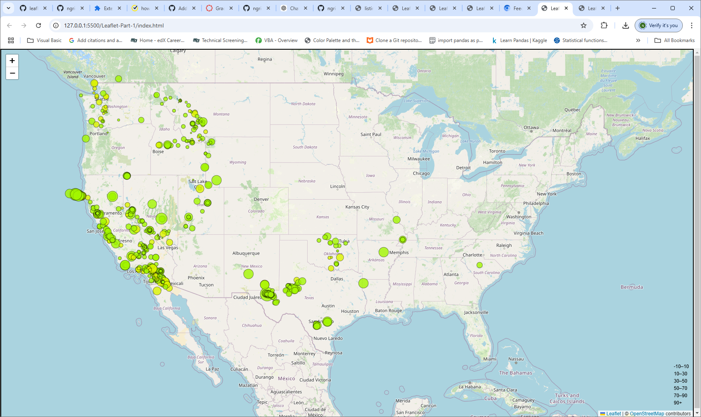

# leaflet-challenge

## Overview

This project is a two-part data visualization challenge using **Leaflet.js** and **D3.js** to explore global earthquake data and tectonic plate boundaries. The visualizations use interactive maps to provide insights into earthquake magnitudes, depths, and their correlation with tectonic plate boundaries.

## Part 1: Earthquake Visualization

### Features:
- Fetches earthquake data from the [USGS GeoJSON API](https://earthquake.usgs.gov/earthquakes/feed/v1.0/geojson.php).
- Visualizes earthquakes as circle markers on a map.
  - **Circle Size**: Proportional to the earthquake's magnitude.
  - **Color**: Indicates the depth of the earthquake.
- Popups display information about each earthquake, including location, magnitude, and depth.
- A legend explains the color scale for earthquake depth.

### Screenshot:
*(Add a screenshot of your Part 1 visualization here)*

---

## Part 2: Earthquakes and Tectonic Plates

### Features:
- Builds on Part 1 by adding tectonic plate boundaries using data from the [Tectonic Plates GitHub repository](https://github.com/fraxen/tectonicplates).
- Integrates multiple map layers:
  - **Base Maps**:
    - Street Map
    - Satellite Map
  - **Overlay Layers**:
    - Earthquake data
    - Tectonic plate boundaries
- Users can toggle layers using an interactive control panel.
- Earthquake data and tectonic plates are styled and displayed with unique visuals for clarity.

### Screenshot:
*(Add a screenshot of your Part 2 visualization here)*

---

## Technologies Used

- **Leaflet.js**: For interactive map rendering.
- **D3.js**: For data fetching and processing.
- **HTML/CSS/JavaScript**: Core web technologies for structure and interactivity.
- **USGS GeoJSON API**: For earthquake data.
- **Tectonic Plates GitHub Repository**: For tectonic plate boundary data.

---

## Getting Started

### Prerequisites:
- A browser capable of running modern JavaScript (e.g., Chrome, Firefox).
- Optionally, a local HTTP server for testing (e.g., Python, Node.js).

### Instructions:

1. Clone this repository:
   ```bash
   git clone https://github.com/ngrief/leaflet-challenge.git
